# 进阶

## 运行模式
Rallie的每个App都有**Host**和**Remote**两种运行模式，当应用作为整个应用集群的入口应用被加载时，应用将以Host模式运行，否则就以Remote模式运行。

以下图这个8个应用的集群为例，当你先加载`/app1.js`时，App1是第一个被创建的应用，它将以Host模式运行，后续加载的应用都将以Remote模式运行。如果你是先加载`/app8.js`，则App8将以Host模式运行，其他App以Remote模式运行
<div align="center" style="padding: 20px">

</div>

由此可见，Rallie的App是去中心化的，也就是说并没有一个固定的中心应用。然而，不同的应用要互相加载和通信，确实需要一个实质的中心来连接，在Rallie中，这个中心就是全局Bus，它负责整个集群中所有应用资源的配置和加载。

App上提供了`runInHostMode`和`runInRemoteMode`两个方法，用于在不同的运行模式下执行不同的逻辑，你可以在这两个方法中访问全局Bus
```ts
const app1 = new App('app1')
registerApp(app1)

app1.runInHostMode((bus) => {
  console.log('仅在Host模式下执行')
  bus.config({
    assets: {
      app2: '/app2.js',
      app3: '/app3.js',
      app4: '/app4.js',
      app5: '/app5.js',
      app6: '/app6.js',
      app7: '/app7.js',
      app8: '/app8.js'
    }
  })
  app1.activate(app1.name)
})
app1.runInRemoteMode((bus) => {
  console.log(bus)
  console.log('仅在Remote模式下执行')
})
```
当App以Host模式运行时，`runInHostMode`的回调逻辑将会执行，你可以在该回调中通过Bus进行一些全局配置或者使用中间件，详情参考[Bus API](/api/#bus)；而当App以Remote模式运行时，`runInRemoteMode`的回调逻辑将会执行。默认情况下，只有Host模式的App才能访问全局Bus，你可以通过在Host模式下开放全局Bus的可访问性来放开这一限制
```ts
app1.runInHostMode((bus, setBusAccessible) => {
  setBusAccessible(true)
})
```
```ts
app2.runInRemoteMode((bus) => {
  // app1开放全局Bus可访问后，app2可以访问全局Bus
  bus?.use(someMiddleware)
})
```

:::tip
Rallie去中心化的特点使得应用本地开发和调试变得非常方便，使用好两种运行模式可以让你从任意一个入口应用启动整个应用集群。
:::

## 生命周期
在[注册](/guide/introduction.html#注册)章节中，我们使用`registerApp`方法注册了App，事实上，这个方法将会返回一个注册实例，你可以接着用这个注册实例直接链式调用指定生命周期回调。

App有Bootstrap、Activate、Destroy三个生命周期
```ts
registerApp(producer)
  .onBootstrap((data) => {
    // do something
  })
  .onActivate((data) => {
    // do something
  })
  .onDestroy((data) => {
    // do something
  })
```
我们可以调用`app.acticvate`和`app.destroy`方法对目标App进行激活和销毁，同时给其注册的生命周期回调传递参数
```ts
consumer.activate('producer', document.getElementById('producer-root'))
consumer.destroy('producer', document.getElementById('producer-root'))
```
你不必为每个生命周期都指定回调函数，事实上，对生命周期的取舍能让你的应用有不同的响应效果。

- 如果只指定了onBootstrap生命周期，应用将只在第一次被激活执行onBootstrap回调，而不会理会后续的激活
- 如果只指定了onActivate生命周期，应用将在每次被激活时都执行onActivate回调
- 如果同时指定了onBootstrap和onActivate生命周期，应用将在第一次被激活时执行onBootstrap回调，在后续被激活时执行onActivate回调

下面展示了App的生命周期图谱，或许你还不能完全明白所有东西，但是随着你的不断学习和深入，它的参考价值会越来越高
<div align="center" style="padding: 20px">

</div>

## 关联和依赖
除了指定生命周期，你还可以在App注册后指定其关联和依赖，这样当你的App启动时，其关联和依赖的App也会被加载或激活
### 关联
还是以[运行模式](#运行模式)章节中的8个App的集群为例，假如App2需要使用App1提供的状态，那么它必须等App1的资源被加载，初始化状态的逻辑被执行后才能对App1的状态进行读，写和监听。此时，我们可以在注册App2时，将App1声明为App2的关联App
```ts
registerApp(app2)
  .relateTo(['app1'])
```
经过这个声明，当你在激活App2时，Rallie会先检查App1是否已经注册，如果没有，则会先加载App1的资源，等App1注册后，才进入App2指定的生命周期回调。你可以指定多个关联App，Rallie会**按顺序**检查并加载关联的App。
### 依赖
假如App2必须等待App1激活后才能正常工作，那么我们可以在注册App2时，将App1声明为App2的依赖
```ts
registerApp(app2)
  .relyOn(['app1'])
```
经过这个声明，当你在**首次激活**App2时，Rallie会先激活App1，然后才进入App2的生命周期

**关联和依赖的区别：**
1. 关联只会加载App，而依赖会激活App
2. 关联不会递归传递，依赖会递归传递。也就是说，如果App1关联了App2，App2又关联了App3，那么在激活App1时，只会加载App2，而不会加载App3，只有当激活App2时才会加载App3，但是，如果App1依赖了App2，App2又依赖了App3，那么在激活App1时，App2和App3都会被激活
3. 允许互相关联，不允许互相依赖。正是因为依赖会递归传递，因此如果出现了环形依赖，就将导致[死锁](https://zh.wikipedia.org/wiki/%E6%AD%BB%E9%94%81)，会抛出激活超时的异常
<div align="center">

</div>


### 共享runtime

## 中间件