# 进阶

## 运行环境

在[加载 Block](/guide/basic.html#加载-block)章节中，我们调用了`block.run`方法，通过回调参数中的运行环境对象 env 来配置应用集群的资源路径。在 Rallie 中， 应用（Block）是去中心化的，但是每个应用其实都运行在一个相同的环境下，这个运行环境可以被认为是应用集群的实质中心

<div align="center" style="padding: 20px">

</div>

对一个 Block 来说，运行环境分为两种：**入口环境**和**非入口环境**。当一个 Block 是整个集群中第一个被创建的 Block 时，可以说该 Block 运行于入口环境，否则，Block 就运行在非入口环境。我们可以通过`env.isEntry`来判断 Block 的运行环境是否是入口环境。

以上图这个 8 个 Block 的集群为例，当你先加载`/app1.js`时，block1 是第一个被创建的应用，它将运行在入口环境，而后续加载的 Block 都将运行在非入口环境。如果你是先加载`/app8.js`，则 block8 将运行在入口环境。

默认情况下，所有的 Block 都可以通过运行环境对象配置集群中其他 Block 的资源加载路径，Block 集群是完全去中心化的。但是，运行在入口环境的 Block 拥有一个特权——冻结运行环境。当运行环境被冻结后，其他 Block 对运行环境的配置将不生效。

```ts {10}
block1.run((env) => {
  env.config({
    assets: {
      block2: {
        js: "/apo2.js",
      },
    },
  });
  if (env.isEntry) {
    env.freeze();
  }
});
```

```ts
block2.run((env) => {
  if (!env.isEntry) {
    env.config({
      assets: {
        block3: {
          js: "/app3.js",
        },
      },
    });
  }
});
```

```ts
block3.run((env) => {
  console.log(env.conf.assets);
  /* block1的配置生效，block2的配置不会生效， 打印结果
   {
     block2: {
       js: [/app2.js]
     }
   }
  */
});
```

这个特性可以让你的应用集群的资源配置收归到一个配置 Block，当其他 Block 运行在入口环境时，先启动这个配置 Block，待资源被统一配置后，再冻结运行环境即可。

:::tip
需要明确的是，虽然我们可以将资源注册收归到某个配置中心，但是 Block 依然是去中心化的，你可以从任意一个入口启动应用集群，这对应用的本地开发和调试非常有用
:::

## 中间件

在前面的例子中，我们配置应用集群的资源路径，都是通过`env.config`方法进行静态配置，当应用数量大且经常需要扩展时，这种配置方法显然非常不灵活。为了解决这个问题，Rallie 参考了[koa](https://github.com/koajs/koa)的中间件设计，提供了让开发者通过中间件控制应用资源查找和加载过程的机制。

举个例子，假如一个集群中的所有 Block 都按照`/${blockName}/index.js`的路径规范被部署到了[jsdelivr](https://www.jsdelivr.com/)上，那么你就可以应用这样一个中间件

```ts
block.run((env) => {
  env.use(async (ctx, next) => {
    await ctx.loadScript(`https://cdn.jsdelivr.net/npm/${ctx.name}/index.js`);
  });
});
```

这样你就不必使用`env.config`手动配置应用的资源路径了。

Rallie 的中间件是一个洋葱圈模型

<div align="center" style="padding: 20px">

</div>

最里层的 Core 中间件会从`env.config`手动配置的资源表中查找资源并加载，在那之前你可以插入自定义的中间件，从而完全接管应用资源的查找、加载和执行全过程。基于中间件，你可以接入常见的微前端框架提供的 js 沙箱，样式隔离，html entry 等特性，甚至可以直接用[动态导入](https://developer.mozilla.org/en-US/docs/Web/JavaScript/Reference/Statements/import#dynamic_imports)来加载应用

:::tip
如果运行环境被冻结，那么运行在非入口环境的 Block 注册的中间件将不会生效
:::

## 关联和依赖
创建Block时，你可以声明关联和依赖的Block

### 关联

还是以[运行环境](#运行环境)章节中的 8 个 Block 的集群为例，假如 block2 需要使用 block1 提供的状态，那么它必须等 block1 的资源被加载，初始化状态的逻辑被执行后才能对 block1 的状态进行读，写和监听。此时，我们可以在注册 block2 时，将 block1 声明为 block2 的关联 Block

```ts
registerBlock(block2).relateTo(["block1"]);
```

经过这个声明，当你在激活 block2 时，Rallie 会先检查 block1 是否已经注册，如果没有，则会先加载 block1 的资源，等 block1 注册后，才进入 block2 指定的生命周期回调。你可以指定多个关联 Block，Rallie 会**按顺序**检查并加载关联的 Block。

### 依赖

假如 block2 必须等待 block1 激活后才能正常工作，那么我们可以在注册 block2 时，将 block1 声明为 block2 的依赖

```ts
registerBlock(block2).relyOn(["block1"]);
```

经过这个声明，当你在**首次激活**block2 时，Rallie 会先激活 block1，然后才进入 block2 的生命周期

**关联和依赖的区别：**

1. 关联只会加载 Block，而依赖会激活 Block。
2. 关联不会递归传递，依赖会递归传递。也就是说，如果 block1 关联了 block2，block2 又关联了 block3，那么在激活 block1 时，只会加载 block2，而不会加载 block3，只有当激活 block2 时才会加载 block3，但是，如果 block1 依赖了 block2，block2 又依赖了 block3，那么在激活 block1 时，block2 和 block3 都会被激活
3. 允许互相关联，不允许互相依赖。正是因为依赖会递归传递，因此如果应用树中出现了循环依赖，就将导致[死锁](https://zh.wikipedia.org/wiki/%E6%AD%BB%E9%94%81)，会抛出异常
<div align="center">

</div>

### 共享公共库

Rallie 把 Block 分为两类，一类是 App，其 js 资源中必须包含调用`registerBlock`注册 Block 的逻辑，然后通过 Block 实例对外提供服务，比如[基础](/guide/basic.html#基础)章节中的 consumer 和 producer；另一类是 Library，其 js 资源中不必包含注册 Block 的逻辑，被加载之后作为整个环境的运行时使用，比如`React`、`Vue`、`jQuery`等第三方库。Rallie 通过应用名是否以`lib:`开头判断应用是 Library 还是 App

```ts
block.run((env) => {
  env.config({
    assets: {
      vue: {
        js: ["https://cdn.jsdelivr.net/npm/vue@3.2.24/dist/vue.global.prod.js"], // vue源码
      },
      "lib:vue": {
        js: ["https://cdn.jsdelivr.net/npm/vue@3.2.24/dist/vue.global.prod.js"], // vue源码
      },
    },
  });

  block.activate("lib:vue"); // 正常运行
  block.activate("vue"); // 抛出异常，因为Vue源码中不包含注册App的逻辑
});
```

多个 Block 往往会使用一些相同的公共库，你可以将他们声明为关联或依赖来确保资源不被重复加载

```ts
block.run((env) => {
  env.config({
    assets: {
      "lib:vue": {
        js: ["https://cdn.jsdelivr.net/npm/vue@3.2.24/dist/vue.global.prod.js"],
      },
    },
  });

  registerBlock(block)
    .relyOn(["lib:vue"]) // 也可以是.relateTo(['lib:vue'])
    .onBootstrap(async () => {
      (await import("./lifecycle")).onBootstrap();
    });
});
```

你或许已经注意到我们在生命周期方法中使用了[动态导入](https://developer.mozilla.org/en-US/docs/Web/JavaScript/Reference/Statements/import#dynamic_imports)，这是因为 block 的资源会先于 Vue 源码被加载，使用动态导入可以让 block 的源码在构建时被分包，在`window.Vue`全局变量被挂载后才加载使用了 Vue 的逻辑。

最后，我们配置一下构建工具的`external`特性即可

- webpack:
  ```ts
  module.exports = {
    externals: {
      vue: "Vue",
    },
  };
  ```
- vite:
  ```ts
  import { viteExternalsPlugin } from "vite-plugin-externals";
  export default defineConfig({
    plugins: [
      viteExternalsPlugin({
        vue: "Vue",
      }),
    ],
  });
  ```
